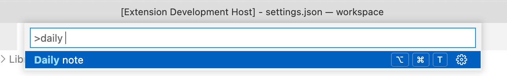
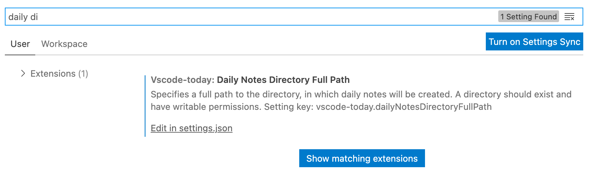

# Daily note

[Download on marketplace](https://marketplace.visualstudio.com/items?itemName=EfimPyshnograev.vscode-today)

This plugin allows to quickly open a file with a daily markdown note.

* File format: `YYYY-MM-DD (ddd).md`.
* Example: `2022-01-03 (Mon).md`.

The advantage of the ISO date format, is that lexicographical file order corresponds with the chronological order.

## Features

A note can be opened from the menu or by assigning a shortcut to it.



## Extension Settings

This extension has a configuration to specify a path for a daily nodes directory:



```json
{
  "vscode-today.dailyNotesDirectoryFullPath": "~/workspace/journal"
}
```
## Release Notes

### 1.0.0

Initial release of the plugin
